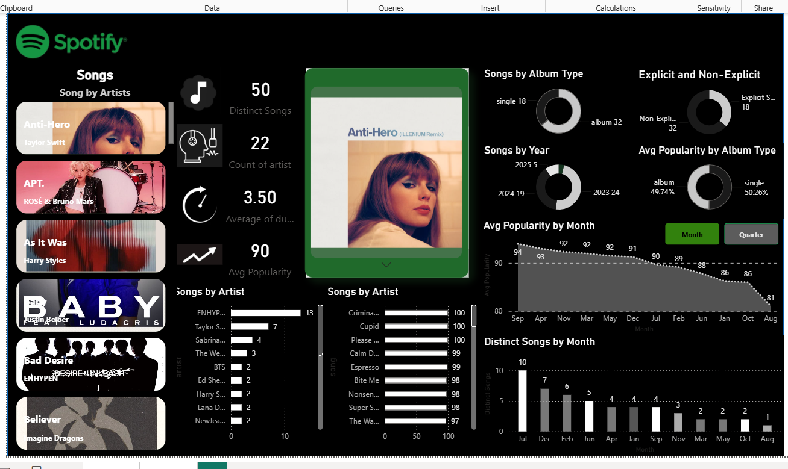

# Spotify Analytics Dashboard

An interactive Spotify Analytics Dashboard built using **Microsoft Power BI** and an **Excel dataset** to analyze songs, artists, popularity, album types, explicit content, and music trends.

## 📊 Project Overview

This project analyzes a Spotify Top 50 dataset and presents the results through an interactive Power BI dashboard.

The dashboard provides a visual overview of:

- Top songs and artists
- Song popularity
- Album types
- Explicit vs. non-explicit songs
- Songs by year
- Average popularity by album type
- Average popularity by month
- Distinct songs by month
- Artist-level song analysis

## 🛠️ Tools & Technologies

- **Power BI** – Data visualization and interactive dashboard development
- **Microsoft Excel** – Dataset and data preparation
- **Power BI Visualizations** – Charts, cards, filters, and interactive elements

## 📈 Dashboard Features

### Key Metrics

- Distinct Songs
- Number of Artists
- Average Song Duration
- Average Popularity

### Visual Analysis

- Songs by Artist
- Songs by Album Type
- Explicit vs. Non-Explicit Songs
- Songs by Year
- Average Popularity by Album Type
- Average Popularity by Month
- Distinct Songs by Month

## 🖼️ Dashboard Preview

## 📂 Files Included

- `Spotify_Analytics_Dashboard.pbix` – Power BI dashboard file
- `spotify_top_50_world.xlsx` – Excel dataset used for analysis
- `spotify-dashboard.png` – Dashboard preview image

## 🎯 Project Objective

The objective of this project is to transform a Spotify dataset into an interactive dashboard that makes music-related data easier to explore and understand through visual analysis.

## 💡 Skills Demonstrated

- Data Analysis
- Data Visualization
- Dashboard Development
- Power BI
- Microsoft Excel
- Data Cleaning
- KPI Reporting
- Interactive Reporting

## 👩‍💻 Author

**Bala Deekshitha Yadav**

B.Tech Graduate | Aspiring Data Analyst
